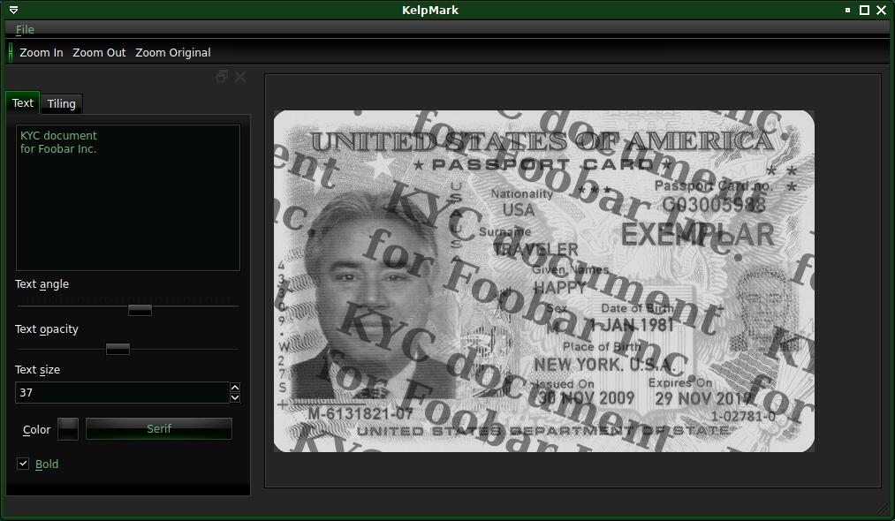

# KelpMark

KelpMark helps creating watermarks on images or PDFs.

## Example

Suppose you have your passport: 

And need to send it to some company, but don't trust them because they might have security breaches and might leak your data.
So you want to watermark it to make it harder to reuse in case of data leak.

Then you can save the resulting image/PDF: 

## Features

- Import multiple images at once
- Import multi-page PDF
- Export to single image
- Export to multi-page PDF
- Watermark text tiling
- Various graphical features

## Requirements

- PyQt5
- python-poppler-qt5

[requirements.txt](requirements.txt)

## License

KelpMark is licensed under the [Unlicense](UNLICENSE).

